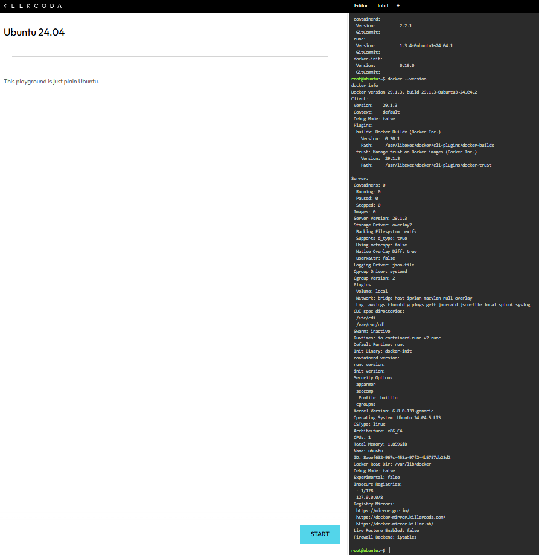
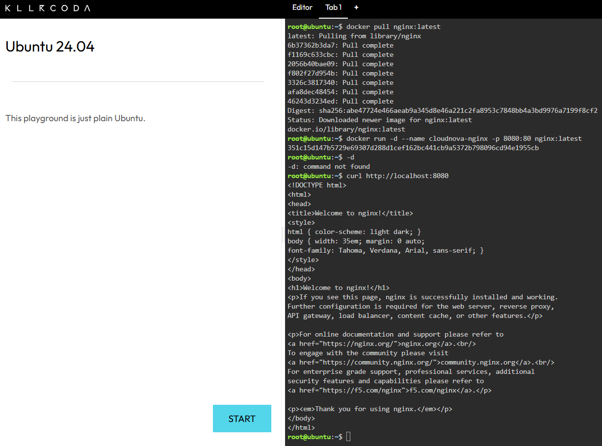
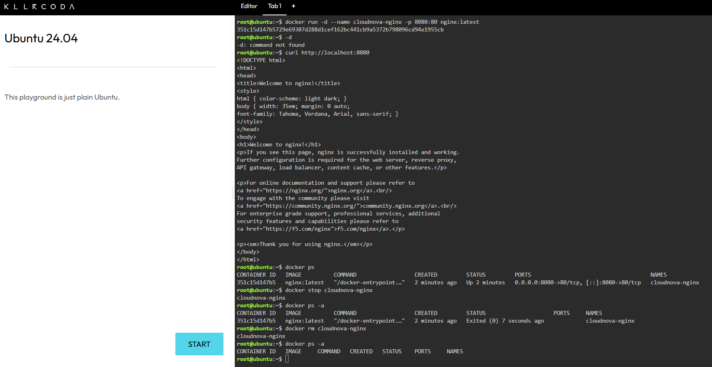

# Laboratory 04 — The Cloud-Native Engineer

## Mission Overview

This laboratory introduced the fundamental concepts of cloud-native engineering and containerization. The activity focused on understanding the differences between traditional Virtual Machines and containers and applying these concepts through a practical Docker deployment.

Using the KillerCoda environment, I verified the Docker installation, downloaded the official Nginx image, deployed a containerized web server, configured port mapping, tested the application, and managed the container through its lifecycle.

## Objectives

The objectives of this laboratory were to:

* Differentiate Virtual Machines from containers.
* Verify Docker availability in a Linux-based environment.
* Pull and use a Docker image from Docker Hub.
* Deploy an Nginx web server inside a container.
* Configure host-to-container port mapping.
* Test a containerized web application.
* Manage the basic lifecycle of a Docker container.
* Document technical procedures using Markdown.
* Maintain screenshots as evidence of completed tasks.

## Docker Commands Executed

### Docker Environment Verification

```bash
docker --version
docker info
docker version
```

### Nginx Deployment

```bash
docker pull nginx:latest
docker run -d --name cloudnova-nginx -p 8080:80 nginx:latest
curl http://localhost:8080
docker ps
```

### Container Lifecycle Management

```bash
docker ps
docker stop cloudnova-nginx
docker ps -a
docker rm cloudnova-nginx
docker ps -a
```

## Skills Learned

Through this laboratory, I developed practical experience in Docker and container-based application deployment. I learned how Docker images are used to create containers and how containers can provide a lightweight environment for running applications.

I also learned how port mapping allows a service inside a container to be accessed through a port on the host system. The container lifecycle exercises provided experience in identifying running containers, stopping them, verifying their state, and removing them when they were no longer needed.

The activity also strengthened my ability to document technical procedures using Markdown and maintain supporting evidence within a GitHub repository.

## Challenges Encountered

One of the main challenges was understanding the relationship between a Docker image and a container. The Nginx image served as the template from which the `cloudnova-nginx` container was created.

Another challenge was understanding port mapping. Nginx uses port 80 inside the container, while port 8080 was exposed on the host. The `-p 8080:80` option connected these two ports and allowed the web server to be accessed through `localhost:8080`.

Managing the container lifecycle also helped clarify the difference between stopping and removing a container. A stopped container still exists and can be viewed using `docker ps -a`, while `docker rm` removes the container itself.

## Evidence

The following screenshots provide evidence of the Docker operations completed during this laboratory.

### 1. Docker Environment Verification

This screenshot shows the verification of the Docker installation and the status of the Docker environment using `docker --version`, `docker info`, and related commands.



**File:** `screenshots/docker-version.png`

---

### 2. Nginx Container Deployment

This screenshot shows the successful HTTP response from the Nginx web server after deploying the container and mapping host port 8080 to container port 80.



**File:** `screenshots/nginx-running.png`

---

### 3. Container Lifecycle Management

This screenshot documents the container lifecycle operations, including listing the container, stopping it, verifying its stopped state, removing it, and confirming its removal.



**File:** `screenshots/container-lifecycle.png`

## Repository Structure

```text
Laboratory-04-Cloud-Native-Engineer/
│
├── README.md
├── virtualization-vs-containers.md
├── docker-deployment.md
├── reflection.md
│
└── screenshots/
    ├── docker-version.png
    ├── nginx-running.png
    └── container-lifecycle.png
```

## Laboratory Status

**Laboratory:** 04 — The Cloud-Native Engineer
**Status:** Completed
**Environment:** KillerCoda Docker Playground
**Containerized Application:** Nginx
**Host Port:** 8080
**Container Port:** 80
